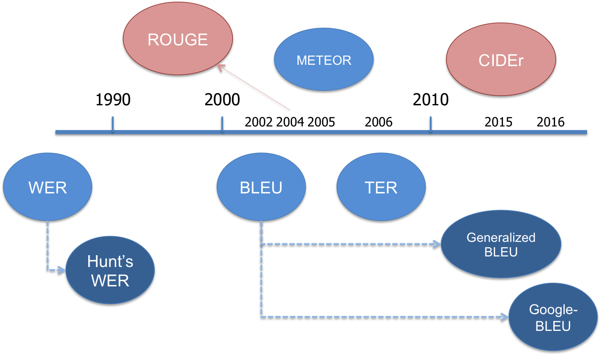

[](https://zenodo.org/badge/latestdoi/125310343)

## About
Natural Language Processing Performance Metrics [[ppt](https://github.com/gcunhase/NLPMetrics/blob/master/assets/NLP_performance_metrics-April6th2018.pdf)]

<p align="center">

</p>

### Contents
[Requirements](#requirements) • [How to Use](#how-to-use) • [Notebooks](#notebooks) • [Quick Notes](#evaluation-metrics-quick-notes) • [How to Cite](#acknowledgement)

## Requirements
Tested on Python 2.7
```
pip install -r requirements.txt
```

## How to Use
* Run: `python test/test_mt_text_score.py`
* Currently only supporting MT metrics

## Notebooks
<table align="center"> 
  <tr>
    <td align="center"><b>Metric</b></td>
    <td align="center"><b>Application</b></td>
    <td align="center" colspan="2"><b>Notebook</b></td>
  </tr>
  <tr>
    <td align="center">BLEU</td><td align="center">Machine Translation</td>
    <td align="center"><a href="https://github.com/gcunhase/NLPMetrics/blob/master/notebooks/bleu.ipynb">Jupyter</a></td>
    <td align="center"><a href="https://colab.research.google.com/github/gcunhase/NLPMetrics/blob/master/notebooks/bleu.ipynb">Colab</a></td>
  </tr>
  <tr>
    <td align="center">GLEU (Google-BLEU)</td><td align="center">Machine Translation</td>
    <td align="center"><a href="https://github.com/gcunhase/NLPMetrics/blob/master/notebooks/gleu.ipynb">Jupyter</a></td>
    <td align="center"><a href="https://colab.research.google.com/github/gcunhase/NLPMetrics/blob/master/notebooks/gleu.ipynb">Colab</a></td>
  </tr>
  <tr>
    <td align="center">WER (Word Error Rate)</td><td align="center">Transcription Accuracy<br>Machine Translation</td>
    <td align="center"><a href="https://github.com/gcunhase/NLPMetrics/blob/master/notebooks/wer.ipynb">Jupyter</a></td>
    <td align="center"><a href="https://colab.research.google.com/github/gcunhase/NLPMetrics/blob/master/notebooks/wer.ipynb">Colab</a></td>
  </tr>
</table>

* TODO:
    * Generalized BLEU (?), METEOR, ROUGE, CIDEr

## Evaluation Metrics: Quick Notes
### Average precision
   * *Macro*: average of sentence scores
   * *Micro*: corpus (sums numerators and denominators for each hypothesis-reference(s) pairs before division)

### Machine Translation
1. **BLEU** (BiLingual Evaluation Understudy)
    * [Papineni 2002](https://www.aclweb.org/anthology/P02-1040.pdf)
    * 'Measures how many words overlap in a given translation when compared to a reference translation, giving higher 
     scores to sequential words.' (recall)
    * Limitation:
        * Doesn't consider different types of errors (insertions, substitutions, synonyms, paraphrase, stems)
        * Designed to be a corpus measure, so it has undesirable properties when used for single sentences.
2. **GLEU** (*Google-BLEU*)
    * [Wu et al. 2016](http://arxiv.org/pdf/1609.08144v2.pdf)
    * Minimum of BLEU recall and precision applied to 1, 2, 3 and 4grams
        * Recall: (number of matching n-grams) / (number of total n-grams in the target)
        * Precision: (number of matching n-grams) / (number of total n-grams in generated sequence)
    * Correlates well with BLEU metric on a corpus metric but does not have its drawbacks for per sentence reward objective.
    * Not to be confused with Generalized Language Evaluation Understanding or *Generalized BLEU*, also known as **GLEU** 
        * Napoles et al. 2015's ACL paper: [*Ground Truth for Grammatical Error Correction Metrics*](http://www.aclweb.org/anthology/P15-2097)
        * Napoles et al. 2016: [*GLEU Without Tuning*](https://arxiv.org/abs/1605.02592)
            * Minor adjustment required as the number of references increases.
        * Simple variant of BLEU, it hews much more closely to human judgements.
        * "In MT, an untranslated word or phrase is almost always an error, but in GEC, this is not the case."
            * GLEU: "computes n-gram precisions over the reference but assigns more weight to n-grams that have been correctly changed from the source." 
        * [Python code](https://github.com/cnap/gec-ranking/)        
3. **WER** (Word Error Rate)
    * Levenshtein distance (edit distance) for words: minimum number of edits (insertion, deletions or substitutions) required to change the hypotheses sentence into the reference.
    * Range: greater than 0 (ref = hyp), no max range as Automatic Speech Recognizer (ASR) can insert an arbitrary number of words
    * $ WER = \frac{S+D+I}{N} = \frac{S+D+I}{S+D+C} $
        * S: number of substitutions, D: number of deletions, I: number of insertions, C: number of the corrects,
            N: number of words in the reference ($N=S+D+C$)
    * WAcc (Word Accuracy) or Word Recognition Rate (WRR): $1 - WER$
    * Limitation: provides no details on the nature of translation errors
        * Different errors are treated equally, even thought they might influence the outcome differently (being more disruptive or more difficult/easier to be corrected).
        * If you look at the formula, there's no distinction between a substitution error and a deletion followed by an insertion error.
    * Possible solution proposed by Hunt (1990):
        * Use of a weighted measure
        * $ WER = \frac{S+0.5D+0.5I}{N} $
        * Problem:
            * Metric is used to compare systems, so it's unclear whether Hunt's formula could be used to assess the performance of a single system
            * How effective this measure is in helping a user with error correction
    * See [more info](https://martin-thoma.com/word-error-rate-calculation/)
4. **METEOR** (Metric for Evaluation of Translation with Explicit ORdering):
    * Banerjee 2005's paper: [*Meteor: An Automatic Metric for MT Evaluation with High Levels of Correlation with Human Judgments*](https://www.cs.cmu.edu/~alavie/METEOR/pdf/Lavie-Agarwal-2007-METEOR.pdf)
    * About: "based on the harmonic mean of unigram precision and recall (weighted higher than precision)"
    * Includes: exact word, stem and synonym matching
    * Designed to fix some of the problems found in the BLEU metric, while also producing good correlation with human
        judgement at the sentence or segment level (unlike BLEU which seeks correlation at the corpus level).
    * [Python jar wrapper](https://github.com/tylin/coco-caption/tree/master/pycocoevalcap/meteor)
5. **TER** (Translation Edit Rate)
    * Snover et al. 2006's paper: [A study of translation edit rate with targeted human annotation](https://www.cs.umd.edu/~snover/pub/amta06/ter_amta.pdf)
    * Number of edits (words deletion, addition and substitution) required to make a machine translation match
        exactly to the closest reference translation in fluency and semantics
    * TER = $\frac{E}{R}$ = (minimum number of edits) / (average length of reference text)
    * It is generally preferred to BLEU for estimation of sentence post-editing effort. [Source](http://opennmt.net/OpenNMT/tools/scorer/).
    * [PyTER](https://pypi.python.org/pypi/pyter/0.2.2.1)
    * **char-TER**: character level TER


### Summarization
1. **ROUGE** (Recall-Oriented Understudy for Gisting Evaluation)
    * Lin 2004: [*ROUGE: A Package for Automatic Evaluation of Summaries*](http://www.aclweb.org/anthology/W/W04/W04-1013.pdf)
    * Package for automatic evaluation of summaries
    

### Image Caption Quality
1. **CIDEr (Consensus-based Image Description Evaluation)**
    * Vedantam et al. 2015: [*CIDEr: Consensus-based Image Description Evaluation*](https://arxiv.org/abs/1411.5726)
    * Used as a measurement for image caption quality
    
## Acknowledgement
Please star or fork if this code was useful for you. If you use it in a paper, please cite as:
```
@misc{cunha_sergio2019nlp_metrics,
    author       = {Gwenaelle Cunha Sergio},
    title        = {The Natural Language Processing Metrics Python Repository},
    month        = oct,
    year         = 2019,
    doi          = {10.5281/zenodo.3496559},
    version      = {v1.0},
    publisher    = {Zenodo},
    url          = {https://github.com/gcunhase/NLPMetrics}
    }
```    
